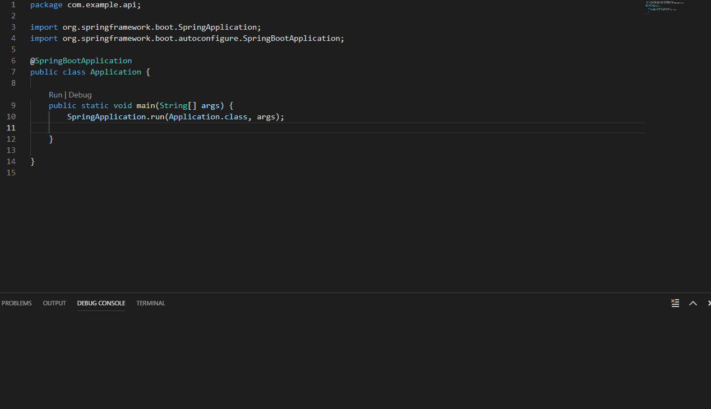
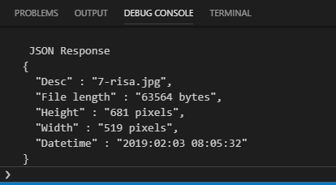

# SpringAPI
API using Spring Boot (Java) which allows a client to provide a photo and return metadata (EXIF) contained in the photo.

## Description
The application is served by a web application http://localhost:8080/
Allows a client to provide the photo via an RPC over HTTP with a JSON data interchange.

### Prerequisites
The response payload returns the following structured attributes represented in a JSON object.

* File length
* Datetime (timestamp) of the photo
* Dimensions of the photo
* Description of the photo

### Third party EXIF library to extract data from photo.

* [metadata extractor](https://github.com/drewnoakes/metadata-extractor) - Extracts Exif, IPTC, XMP, ICC and other metadata from image and video files

## Installation 
Clone this repo to local computer and open with preferred IDE or text editor. Build and run the application
 

## Usage
Head to http://localhost:8080/. Click on the **Choose file** button and select an image of your choice and click **Upload**. A JSON object containing the metadata of the image should be displayed.

## Console
Go into your Debug console to see the JSON response formatted.

